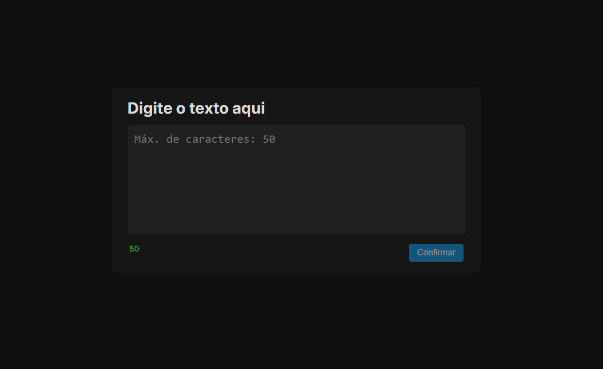

<h1 align="center"> Smart Textarea </h1>

  <a href="#-tecnologias">Tecnologias</a>&nbsp;&nbsp;&nbsp;|&nbsp;&nbsp;&nbsp;
  <a href="#-projeto">Projeto</a>&nbsp;&nbsp;&nbsp;|&nbsp;&nbsp;&nbsp;
  <a href="#-funcionalidades">Funcionalidades</a>&nbsp;&nbsp;&nbsp;|&nbsp;&nbsp;&nbsp;
  <a href="#-como-executar">Como executar</a>

 

  

## 🚀 Tecnologias

Esse projeto foi desenvolvido com as seguintes tecnologias:

- [React](https://reactjs.org)
- [JavaScript](https://developer.mozilla.org/pt-BR/docs/Web/JavaScript)
- [CSS](https://developer.mozilla.org/pt-BR/docs/Web/CSS)

## 💻 Projeto

<h4> Acesse em: https://smart-textarea.vercel.app </h4>

Um campo de texto inteligente que alerta o usuário sobre a quantidade e o limite de caracteres.

## 🚀 Funcionalidades

- Contagem de caracteres
- Costumização do máximo de caracteres
- Alteração da cor do contador baseado na quantidade de caracteres restantes
- Botão de submit que mostra o texto digitado caso a quantidade de caracteres for aceita

## 🚀 Como executar

- Clone o repositório
- Instale as dependências com `yarn`
- Inicie o servidor com `yarn start`

Agora você pode acessar [`localhost:3000`](http://localhost:3000) do seu navegador.

---

<h4 align="center"> Feito com ♥ por Marcelino Teixeira </h4>
